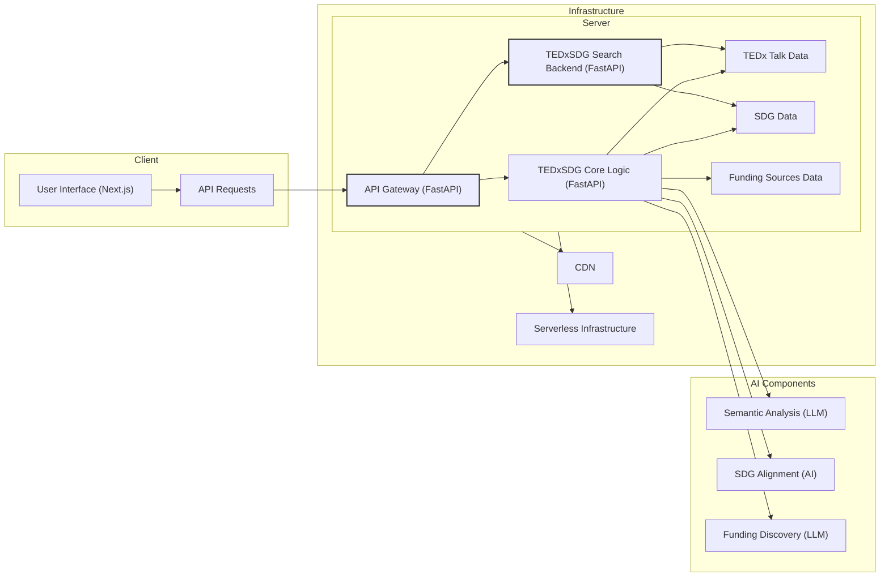

# TEDxSDG: Non-profit Tool Advancing the United Nations Sustainable Development Goals (SDGs)

## Summary

TEDxSDG empowers non-profits and individuals to contribute to the UN's Sustainable Development Goals by providing AI-powered tools for inspiration, planning, and funding. It combines ideation, relevance, planning, execution, scalability, and responsible AI practices to offer a comprehensive solution for addressing global challenges.

## 🌟 Key Features

### 1. Inspiration Phase
- **TEDx Talk Analysis**: Semantic analysis of TEDx talks to extract ideas and actionable insights.
- **SDG Alignment**: Automatic mapping of ideas to relevant UN Sustainable Development Goals.

### 2. Planning Phase
- **Roadmaps**: Project planning facilitated by examples of successful initiatives.
- **Resource Planning**: Automated timeline generation based on customizable templates.

### 3. Funding Phase
- **Funding Discovery**: Leveraging LLMs and targeted internet searches to connect projects with potential funding sources.
- **Simplified Matching**: Streamlining the process of identifying potential grant providers or impact investors tailored to the non-profit’s mission and goals.


## Addressing Societal Challenges & UN SDG Alignment

TEDxSDG directly addresses global societal challenges by supporting projects aligned with the UN Sustainable Development Goals (SDGs).  AI-powered SDG alignment ensures each project idea targets specific challenges, enhancing community resilience by transforming concepts into actionable development projects.

## Innovative Use of AI

TEDxSDG leverages AI in innovative ways:

- **Semantic Analysis of TEDx Talks**: Extracts key insights and actionable knowledge to inspire and guide project ideation.
- **Automated SDG Mapping**: Intelligently aligns project ideas with relevant SDGs, increasing efficiency and impact.
- **AI-Powered Funding Discovery**: Uses LLMs and internet searches to streamline funding identification, connecting projects with potential funders.

## Technical Execution & Architecture

- **Next.js & FastAPI Integration**: Ensures seamless front-end and back-end coordination for a robust and responsive user experience.
- **CDN-Based Architecture**: Enhances performance, reduces operational complexity, and simplifies maintenance.
- **Modular Design**: Built with modular components for easy scaling, feature enhancement, and adaptability.

## Real-World Impact & Measurable Outcomes

TEDxSDG has the potential to create significant real-world impact by:

- **Promoting SDG Alignment**: Encourages individuals and organizations to contribute to global challenges by aligning their projects with the SDGs.
- **Facilitating Funding**: Connects projects with relevant funding sources, increasing the likelihood of implementation and measurable impact on communities.  We aim to facilitate the launch of three TEDAI For Good Hackathon ideas within the first year.

## Scalability & Global Reach

- **Serverless Architecture**: Enables efficient scaling to meet global demand and ensures platform stability.
- **Multilingual Support**: AI-powered NLP facilitates localization, making the tool adaptable to various languages and regions for broader accessibility. (See Responsible AI for details on the localization approach).

## Usability & Accessibility for All

- **Intuitive Interface**: Designed for ease of use, even for users with limited technical expertise.
- **Accessibility Features**: Built with accessibility in mind, accommodating users with diverse abilities and ensuring equitable access.
- **Modular Project Planning Tools**: Simplifies the process of translating ideas into actionable roadmaps, breaking down complex tasks into manageable steps.

## Presentation & Documentation

- **User-Centric Presentation**: Showcases the end-to-end user journey, from inspiration to funding, highlighting the platform's practical value.
- **SDG-Aligned Design**: Visually integrates SDG themes to enhance relevance and clarity.
- **Comprehensive Documentation**: Provides clear and accessible documentation to enable non-profit organizations to understand, replicate, or adapt the tool.

## Responsible AI & Ethical Considerations

- **Data Privacy**: Minimizes personal information collection and prioritizes user privacy.
- **Transparency & Explainability**: Provides transparent and explainable recommendations, with clear source attribution for funding opportunities.
- **Limitations & Mitigation Strategies**:
    * **Funding Discovery:** The dynamic nature of grant funding presents challenges. We mitigate this through a curated database, smart filtering with advanced NLP, and human-in-the-loop validation for key projects.
    * **Localization:** High-quality localization is resource-intensive. Our strategy involves professional translation for core elements, supplemented by community-based translation and prioritized language support based on user demand.  AI-powered translation will be used to create initial drafts and assist the translation process.
    * **Scalability:** Meeting global demand requires robust infrastructure. We leverage serverless architecture, CDN integration, and continuous performance monitoring and optimization.
    * **Usability:** Creating intuitive interfaces requires iterative design. We employ user-centered design principles, beta testing, and ongoing user feedback integration.

## Technical Requirements

- Next.js (JavaScript front-end framework)
- FastAPI (Python back-end framework)

# TEDxSDG Search Backend

A semantic search engine that connects TEDx Talks with UN Sustainable Development Goals (SDGs).

## Overview

The **tedxsdg-search-backend** implements semantic search to find relevant TEDx talks (a publicly available dataset) based on SDG-related queries. The system analyzes talk transcripts and descriptions to match them with SDG themes and user queries.

## Technical Implementation

The search engine utilizes several key technologies:

* **TF-IDF** (Term Frequency-Inverse Document Frequency)
  * Converts text data into numerical vectors representing word relevance
  * Enables efficient text comparison and matching

* **Cosine Similarity**
  * Measures similarity between query and document vectors
  * Ranks results based on relevance scores

* **scikit-learn's TfidfVectorizer**
  * Creates sparse TF-IDF matrix from transcripts and descriptions
  * Optimizes memory usage and computation speed

## API Usage

API documentation is available at: [https://tedxsdg-search-backend.vercel.app/api/search/redoc](https://tedxsdg-search-backend.vercel.app/api/search/redoc)

### Example Query

To search for content related to SDG 7 (Affordable and Clean Energy):

```bash
GET https://tedxsdg-search-backend.vercel.app/api/search?query=sdg7
```

### Example Response

```json
{
  "results": [
    {
      "score": 0.540540832015223,
      "document": {
        "slug": "ksenia_petrichenko_what_if_buildings_created_energy_instead_of_consuming_it",
        "description": "Buildings are bad news for the climate -- but they don't have to be…",
        "presenterDisplayName": "Ksenia Petrichenko",
        "transcript": "… Buildings that can consume and produce energy efficiently, interact with a smart grid and respond to its signals, providing flexibility and bringing us closer to our climate targets… ",
        "sdg_tags": [
          "sdg7"
        ]
      }
    }
  ]
}
```

### Response Fields

* `score`: Relevance score based on cosine similarity (0-1)
* `document`: Contains the matched TEDx talk information
  * `slug`: Unique identifier for the talk
  * `description`: Summary of the talk
  * `presenterDisplayName`: Speaker's name
  * `transcript`: Transcript from the talk
  * `sdg_tags`: SDG identifier

## Technical Diagram



## License

GNU Affero General Public License v3.0 - see LICENSE for details.

Built with ❤️ for the TEDAI For Good Hackathon 2024
