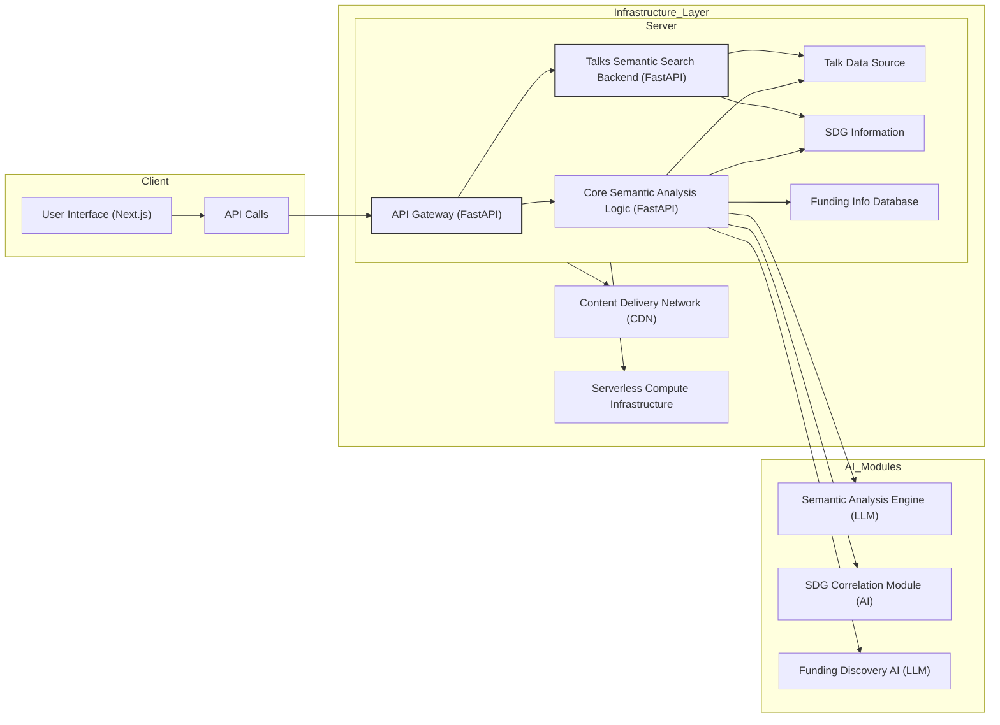

# semantic-analysis-of-talks-using-llms

## Overview

This **semantic-analysis-of-talks-using-llms** platform empowers non-profit organizations and individuals to contribute to the UN's Sustainable Development Goals (SDGs) by offering AI-driven tools for inspiration, project planning, and funding acquisition. It merges ideation, relevance assessment, planning, execution, scalability, and responsible AI principles to provide a thorough solution for tackling global challenges.

## 🌟 Core Capabilities

### 1. Inspiration Stage

- **Talk Analysis**: Semantic examination of inspirational talks (e.g., TEDx) to derive ideas and actionable takeaways.
- **SDG Correlation**: Automatic mapping of derived concepts to pertinent UN Sustainable Development Goals.

### 2. Planning Stage

- **Development Roadmaps**: Project planning aided by examples of successful past initiatives.
- **Resource Allocation**: Automated timeline creation based on adaptable templates.

### 3. Funding Stage

- **Funding Source Identification**: Utilizing LLMs and targeted internet searches to link projects with prospective funding avenues.
- **Simplified Matching Process**: Streamlining the identification of potential grant providers or impact investors aligned with the non-profit’s mission and objectives.

## Tackling Societal Issues & UN SDG Alignment

This system directly confronts global societal issues by championing projects aligned with the UN Sustainable Development Goals (SDGs). AI-enhanced SDG alignment ensures each project concept specifically targets defined challenges, thereby boosting community resilience by transforming ideas into feasible development projects.

## Innovative AI Utilization

This platform leverages AI in novel ways:

- **Semantic Analysis of Talks**: Extracts crucial insights and actionable knowledge to inspire and direct project conceptualization.
- **Automated SDG Mapping**: Intelligently aligns project concepts with relevant SDGs, enhancing efficiency and impact.
- **AI-Driven Funding Identification**: Employs LLMs and internet searches to simplify the funding discovery process, connecting projects with potential financial backers.

## Technical Implementation & Architecture

- **Next.js & FastAPI Synergy**: Ensures smooth front-end and back-end coordination for a durable and responsive user experience.
- **CDN-Based Infrastructure**: Boosts performance, minimizes operational complexity, and simplifies upkeep.
- **Modular Architecture**: Constructed with modular elements for straightforward scaling, feature additions, and adaptability.

## Real-World Effect & Quantifiable Results

This platform has the potential to generate substantial real-world impact by:

- **Promoting SDG Alignment**: Motivates individuals and organizations to contribute to global challenges by aligning their initiatives with the SDGs.
- **Facilitating Funding Access**: Connects projects with suitable funding sources, improving the chances of implementation and measurable community impact. We aim to assist in launching three TEDAI For Good Hackathon concepts within the initial year.

## Scalability & Worldwide Reach

- **Serverless Design**: Permits efficient scaling to satisfy global demand and ensures platform robustness.
- **Multilingual Capability**: AI-driven NLP facilitates localization, making the tool adaptable to various languages and regions for wider accessibility. (Refer to Responsible AI for specifics on the localization strategy).

## User-Friendliness & Universal Accessibility

- **Intuitive User Interface**: Designed for ease of navigation, even for users with limited technical proficiency.
- **Accessibility Considerations**: Developed with accessibility as a priority, accommodating users with diverse abilities and ensuring fair access.
- **Modular Project Planning Utilities**: Simplifies the conversion of ideas into actionable plans, breaking down intricate tasks into manageable phases.

## Presentation & Supporting Materials

- **User-Focused Presentation**: Demonstrates the complete user journey, from inspiration to securing funds, highlighting the platform's practical utility.
- **SDG-Themed Design**: Visually incorporates SDG motifs to improve relevance and lucidity.
- **Extensive Documentation**: Offers clear and readily available documentation to enable non-profit organizations to comprehend, replicate, or modify the tool.

## Responsible AI & Ethical Framework

- **Data Privacy Assurance**: Minimizes collection of personal information and prioritizes user privacy.
- **Transparency & Interpretability**: Delivers transparent and understandable recommendations, with clear attribution for funding opportunity sources.
- **Limitations & Mitigation Approaches**:
  - **Funding Identification:** The fluctuating nature of grant funding poses challenges. We address this through a curated database, intelligent filtering with advanced NLP, and human-in-the-loop verification for key projects.
  - **Localization:** High-quality localization is resource-intensive. Our approach involves professional translation for core components, augmented by community-sourced translation and prioritized language support based on user demand. AI-powered translation will be used for initial drafts and to assist the translation workflow.
  - **Scalability:** Meeting global demand necessitates robust infrastructure. We utilize serverless architecture, CDN integration, and ongoing performance monitoring and optimization.
  - **Usability:** Crafting intuitive interfaces requires iterative design. We adhere to user-centered design principles, conduct beta testing, and continually integrate user feedback.

## Technical Stack Requirements

- Next.js (JavaScript front-end framework)
- FastAPI (Python back-end framework)

# Talks Semantic Search Backend

A semantic search engine designed to connect inspirational talks (e.g., TEDx Talks) with UN Sustainable Development Goals (SDGs).

## Overview

The **semantic-talks-search-backend** component implements semantic search to locate relevant talks (from a publicly available dataset) based on queries related to SDGs. The system analyzes talk transcripts and descriptions to match them with SDG themes and user inquiries.

## Technical Implementation Details

The search engine employs several key technologies:

- **TF-IDF** (Term Frequency-Inverse Document Frequency)

  - Converts textual data into numerical vectors that represent word importance.
  - Facilitates efficient text comparison and matching.

- **Cosine Similarity**

  - Measures the similarity score between query vectors and document vectors.
  - Ranks search results based on these relevance scores.

- **scikit-learn's TfidfVectorizer**
  - Generates a sparse TF-IDF matrix from talk transcripts and descriptions.
  - Optimizes memory utilization and computational speed.

### Example Query

To search for content related to SDG 7 (Affordable and Clean Energy):

```bash
GET https://tedxsdg-search-backend.vercel.app/api/search?query=sdg7
```

### Example Response

```json
{
  "results": [
    {
      "score": 0.540540832015223,
      "document": {
        "slug": "ksenia_petrichenko_what_if_buildings_created_energy_instead_of_consuming_it",
        "description": "Buildings are bad news for the climate -- but they don't have to be…",
        "presenterDisplayName": "Ksenia Petrichenko",
        "transcript": "… Buildings that can consume and produce energy efficiently, interact with a smart grid and respond to its signals, providing flexibility and bringing us closer to our climate targets… ",
        "sdg_tags": ["sdg7"]
      }
    }
  ]
}
```

### Response Fields

- `score`: Relevance score based on cosine similarity (ranges from 0 to 1).
- `document`: Contains information about the matched talk.
  - `slug`: A unique identifier for the talk.
  - `description`: A summary of the talk.
  - `presenterDisplayName`: The name of the speaker.
  - `transcript`: The transcript from the talk.
  - `sdg_tags`: Identifier for the associated SDG.

## System Architecture Diagram


